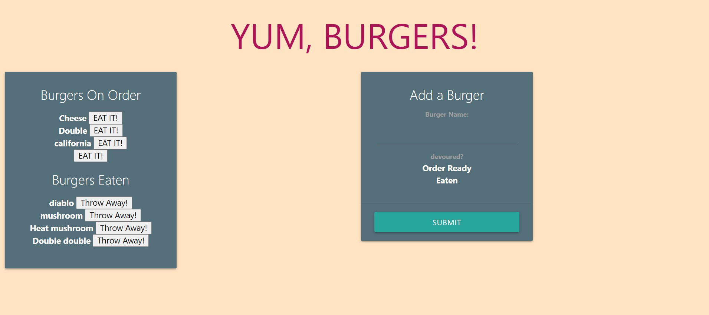

# Burger

## Author

Heather Stolz

## Table of Contents:

* [Description](#description)
* [Installation](#installation)
* [Usage](#usage)
* [improvements](#improvements)
* [Links/Images](#Links/Images)
* [Questions](#questions)

## Description

An app using express handlebars that allows a user to add burgers to eat, eat them(devour), then throw them away(delete).

## Installation

Please run these commands to install dependancies for this project: npm i

## Usage

Burger is a restaurant app that lets users input the names of burgers they'd like to eat.

## Improvements

* Styling. Definitely styling.

## Links/Images

[deployment](https://arcane-scrubland-89938.herokuapp.com/ )

## Questions

If you have any questions regarding this project, you can find me at [Wanderingtech](https://github.com/Wanderingtech) 

and/or at heather86lyn@gmail.com.
